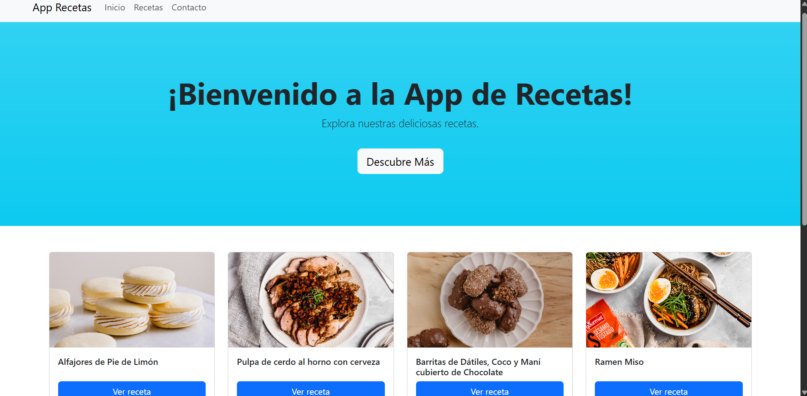
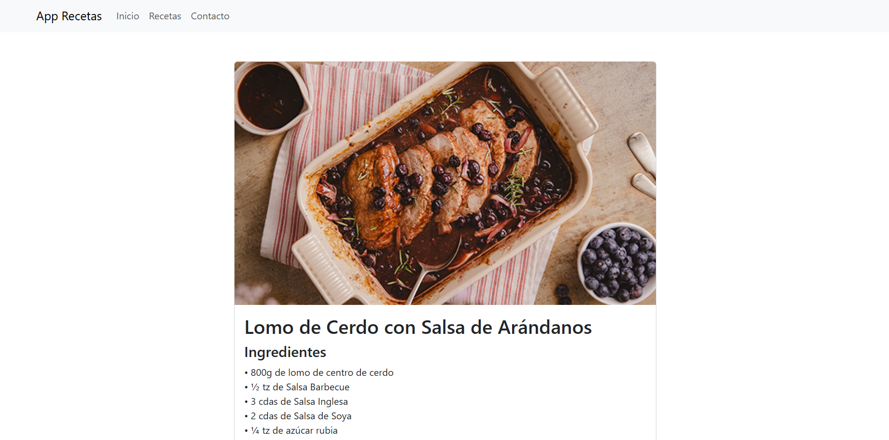
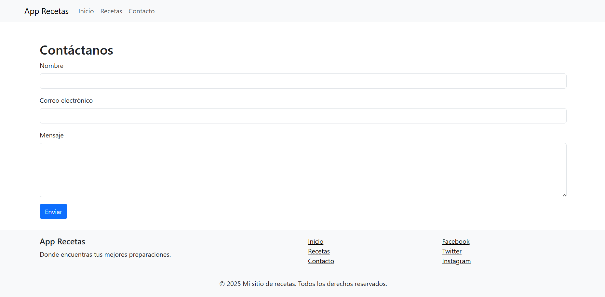

# 🍽️ App de Recetas - Proyecto Full Stack con Django

Este es un proyecto desarrollado como parte del **Bootcamp de Desarrollador Full Stack Python**, cuyo objetivo fue construir una aplicación web dinámica de recetas utilizando el framework **Django**.

---

## 🧠 Descripción del Proyecto

La **App de Recetas** es un sitio web donde los usuarios pueden:

- Visualizar una lista de recetas
- Acceder al detalle completo de cada receta (ingredientes, instrucciones, imagen)
- Enviar mensajes a través de un formulario de contacto
- Navegar fácilmente a través de una interfaz moderna y responsiva con **Bootstrap**

También se implementó manejo de errores y almacenamiento de mensajes en la base de datos.

---

## 🛠️ Tecnologías utilizadas

- 🐍 Python 3.x
- 🌐 Django 4.x
- 💾 SQLite (base de datos local, incluye ejemplos)
- 🎨 Bootstrap 5 (para el diseño responsivo)
- 🖼️ HTML5 (CSS3 se considera para mejoras futuras)
- ☁️ Django Admin (para visualizar modelos como recetas y mensajes)

---

## 📂 Estructura del Proyecto
```bash
app_recetas/
├── app_recetas/ # Configuración principal del proyecto
├── lista_recetas/ # App principal
│ ├── templates/ # Plantillas HTML
│ ├── models.py # Modelos Receta y MensajeContacto
│ ├── views.py # Vistas funcionales
│ ├── urls.py # Enrutamiento de la app
├── screenshots/ # Capturas de pantalla usadas en este README
│ ├── home.png
│ ├── recetas.png
│ └── contacto.png
├── media/ # Archivos de imagen de cada receta
├── db.sqlite3 # Base de datos
├── manage.py
├── README.md # Este archivo
```
## 🚀 ¿Cómo ejecutar el proyecto localmente?

1. **Clona el repositorio:**

```bash
git clone https://github.com/EstefanyRodriguezP/app-recetas-django.git
cd app-recetas-django
```
2. **Crea un entorno virtual (opcional pero recomendado):**
```bash
python -m venv venv
# Activa el entorno:
# En Windows:
venv\Scripts\activate
# En Mac/Linux:
source venv/bin/activate
```
3. **Instala las dependencias:**
```bash
pip install -r requirements.txt
```
4. **Aplica las migraciones:**
```bash
python manage.py migrate
```
5. **Cargar datos iniciales (fixtures):**
Este proyecto incluye datos de ejemplo para que la app tenga recetas y mensajes ya cargados. Esto insertará los datos en la base de datos local.
```bash
python manage.py loaddata initial_data.json
```
6. **Ejecutar el servidor**
```bash
python manage.py runserver
```
7. **Abre el navegador en:**
```bash
http://127.0.0.1:8000/
```

## 🖼️ Capturas de Pantalla

### 🏠 Página de Inicio

Muestra un mensaje de bienvenida y las recetas más recientes.



---

### 📄 Detalle de una Receta

Vista individual con imagen, ingredientes y pasos detallados.



---

### 📬 Página de Contacto

Formulario que permite a los usuarios enviar un mensaje. Los datos se almacenan en la base de datos.



---


## 🧪 Funcionalidades Principales

- ✅ Listado dinámico de recetas desde la base de datos
- ✅ Página de detalles individuales por receta
- ✅ Formulario de contacto con validación y almacenamiento en DB
- ✅ Navegación entre páginas con Navbar y Footer
- ✅ Interfaz responsiva gracias a Bootstrap
- ✅ Manejo de errores (404 personalizado)
- ✅ Archivos estáticos (CSS e imágenes de recetas)

---

## 📌 Autora

**Estefany Rodríguez**  
🔗 [GitHub: @EstefanyRodriguezP](https://github.com/EstefanyRodriguezP)

---

## 📝 Licencia

Este proyecto fue creado con fines educativos como parte del proceso de formación del bootcamp. Puedes usarlo libremente como base para tus propios desarrollos académicos o personales.